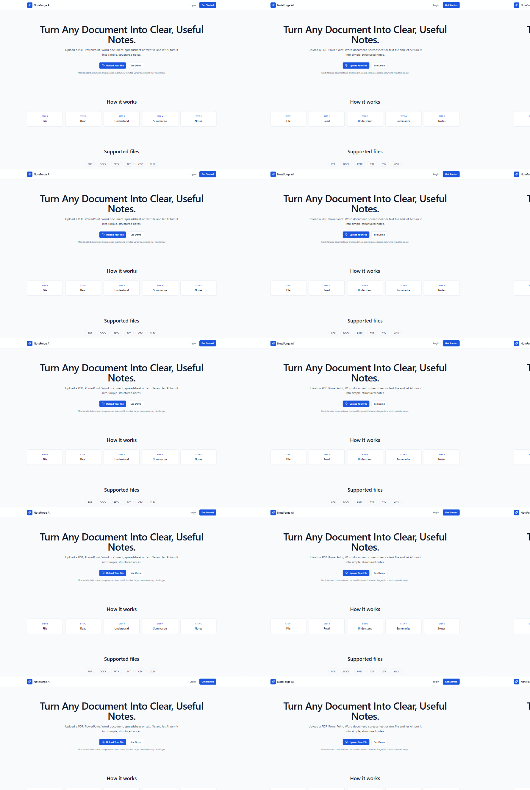
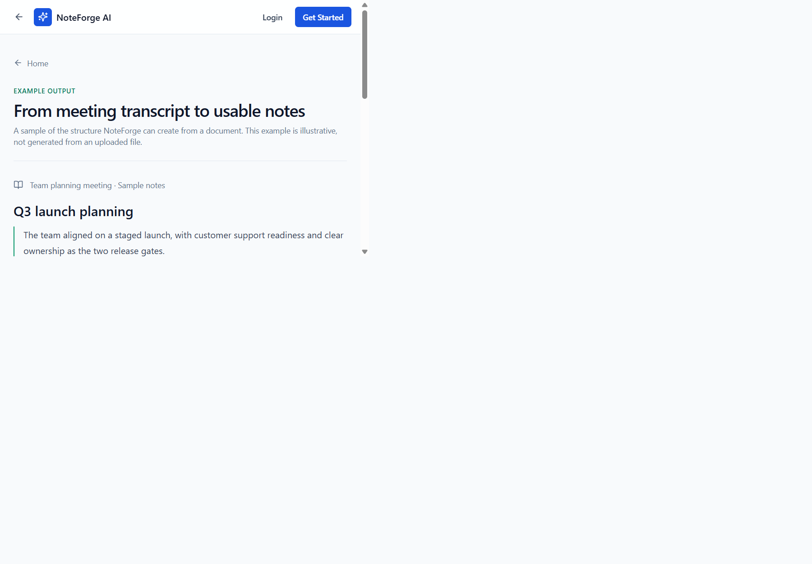
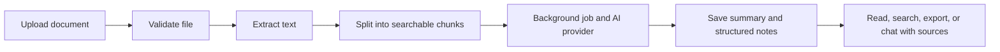
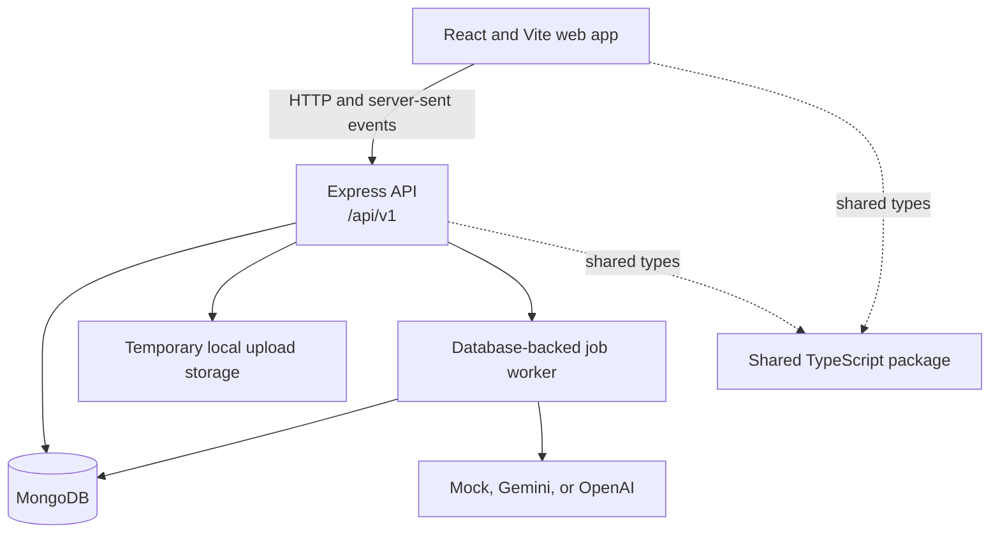
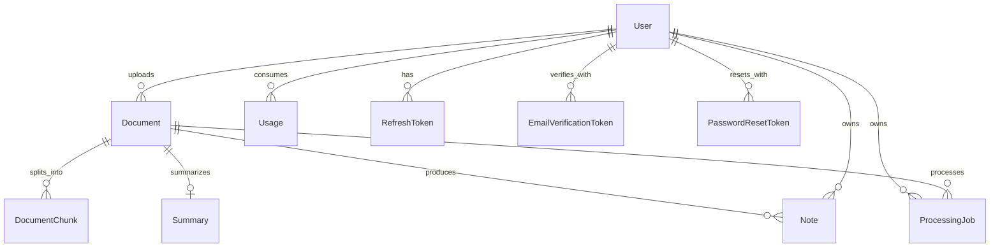

# NoteForge AI

NoteForge AI turns uploaded documents into structured notes, summaries, and source-aware answers. It is a TypeScript monorepo with a React web app, an Express/Mongoose API, and a shared package.

## At A Glance

- **Upload:** PDF, DOCX, PPTX, TXT, CSV, and XLSX files.
- **Understand:** extract text, split it into searchable chunks, and process it in the background.
- **Create:** summaries and notes in quick, detailed, study, exam, executive, technical, meeting, or custom mode.
- **Ask:** chat about a document and show references to source pages, slides, sections, or chunks when available.
- **Organize:** browse documents, processing history, notes, and favorites; export notes from the app.
- **Manage:** email verification, password reset, account preferences, usage limits, and admin views.
- **Choose an AI provider:** mock mode for local setup, or Gemini/OpenAI with your own API key.

## Demo

| Landing page | Sample notes demo |
| --- | --- |
|  |  |

### How A Document Becomes Notes



## Pages

The app has **25 product pages**, plus a not-found page. `/app/dashboard` redirects to `/app` and is not a separate page.

| Area | Pages |
| --- | --- |
| Public | Landing, demo, help, privacy, terms |
| Authentication | Login, register, forgot password, reset password, verify email |
| Signed-in app | Dashboard, upload, documents, document details, processing status, document notes, document chat, profile, history, favorites, settings |
| Admin | System overview, users, documents, jobs |

## Architecture



### MongoDB Collections

Mongoose creates these collections using its default pluralized, lowercase model names. Embedded preferences, note sections, and source references are subdocuments, not separate collections.

| Collection | What it stores |
| --- | --- |
| `users` | Accounts, password hashes, roles, verification state, and preferences |
| `documents` | Uploaded-file metadata, processing status, summary options, favorites, and soft-delete state |
| `documentchunks` | Extracted text chunks and page/slide locations used for search and chat context |
| `summaries` | Generated short, executive, and detailed summaries, key points, definitions, questions, and source references |
| `notes` | Structured note sections, modes, language, and favorites |
| `processingjobs` | Background queue status, progress, retry and lock information |
| `usages` | Per-user daily/monthly document, page, byte, and AI request counts |
| `refreshtokens` | Hashed refresh tokens and session/revocation metadata |
| `emailverificationtokens` | Hashed, expiring email-verification tokens |
| `passwordresettokens` | Hashed, expiring password-reset tokens |



## Requirements

- Node.js and npm (the repository declares npm `10.9.3` as its package manager).
- A MongoDB server, either local or MongoDB Atlas.
- An AI API key only when using Gemini or OpenAI. Mock mode is the default.

## Environment Setup

The API reads its environment from `apps/api/.env`. Start by copying the committed example:

```powershell
Copy-Item apps/api/.env.example apps/api/.env
```

Set `MONGODB_URI` to your local MongoDB URL or Atlas connection string. Generate two different JWT secrets (each at least 32 characters) with this command, running it twice:

```powershell
node -e "console.log(require('crypto').randomBytes(32).toString('hex'))"
```

Paste the generated values into `JWT_ACCESS_SECRET` and `JWT_REFRESH_SECRET`. For real AI-generated results, set `AI_PROVIDER` to `gemini` or `openai` and provide the matching API key. Keep `.env` private; only `.env.example` belongs in Git.

The web app uses the Vite development proxy by default, so no web `.env` file is needed for local development. `VITE_API_URL` is optional when the API is hosted separately; set it to the API origin without `/api/v1` (for example, `https://api.example.com`).

## Run Locally

From the repository root, install dependencies once:

```bash
npm install
```

With MongoDB running and `apps/api/.env` configured, start each service in a separate terminal:

```bash
npm run dev:api
```

```bash
npm run dev:web
```

Open the web app at [http://localhost:5173](http://localhost:5173). The API defaults to port `5000`; check [http://localhost:5000/api/health](http://localhost:5000/api/health). The Vite proxy forwards `/api` requests to that API.

## Useful Commands

| Command | Purpose |
| --- | --- |
| `npm run build` | Build all workspaces |
| `npm run typecheck` | Type-check all workspaces |
| `npm run lint` | Lint the repository |
| `npm test --workspace @noteforge/api` | Run API tests |
| `npm test --workspace @noteforge/web` | Run web tests |

## Repository Structure

```text
docs/        Architecture, API, deployment, free-tier, and security notes
apps/api/       Express API, Mongoose models, parsers, jobs, workers, tests
apps/web/       React pages, components, API clients, and Vite configuration
packages/shared/ Types and schemas shared between the web app and API
docs/           Architecture, API, deployment, free-tier, and security notes
```

See [API documentation](docs/API.md), [architecture](docs/ARCHITECTURE.md), [deployment notes](docs/DEPLOYMENT.md), and [security notes](docs/SECURITY.md) for more detail.
