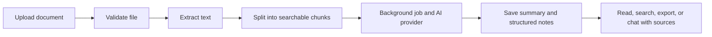
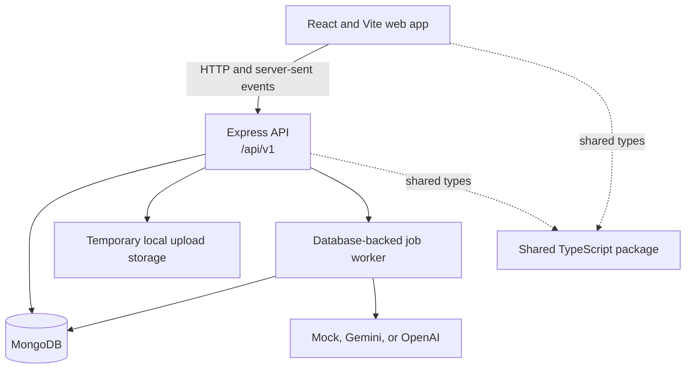
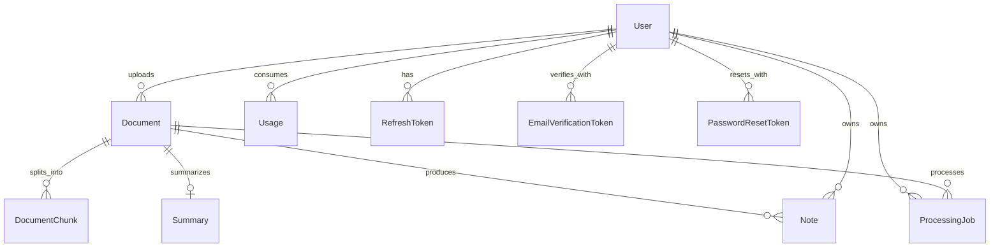

# NoteForge AI

NoteForge AI turns uploaded documents into structured notes, summaries, and source-aware answers. It is a TypeScript monorepo with a React web app, an Express/Mongoose API, and a shared package.

## At A Glance

- **Upload:** PDF, DOCX, PPTX, TXT, CSV, and XLSX files.
- **Understand:** extract text, split it into searchable chunks, and process it in the background.
- **Create:** summaries and notes in quick, detailed, study, exam, executive, technical, meeting, or custom mode.
- **Ask:** chat about a document and show references to source pages, slides, sections, or chunks when available.
- **Organize:** browse documents, processing history, notes, and favorites; export notes from the app.
- **Manage:** email verification, password reset, account preferences, usage limits, and admin views.
- **Choose an AI provider:** mock mode for local setup, or Gemini/OpenAI with your own API key.

## Demo

| Landing page | Sample notes demo |
| --- | --- |
|  |  |

### How A Document Becomes Notes



## Pages

The app has **25 product pages**, plus a not-found page. `/app/dashboard` redirects to `/app` and is not a separate page.

| Area | Pages |
| --- | --- |
| Public | Landing, demo, help, privacy, terms |
| Authentication | Login, register, forgot password, reset password, verify email |
| Signed-in app | Dashboard, upload, documents, document details, processing status, document notes, document chat, profile, history, favorites, settings |
| Admin | System overview, users, documents, jobs |

## Architecture



### MongoDB Collections

Mongoose creates these collections using its default pluralized, lowercase model names. Embedded preferences, note sections, and source references are subdocuments, not separate collections.

| Collection | What it stores |
| --- | --- |
| `users` | Accounts, password hashes, roles, verification state, and preferences |
| `documents` | Uploaded-file metadata, processing status, summary options, favorites, and soft-delete state |
| `documentchunks` | Extracted text chunks and page/slide locations used for search and chat context |
| `summaries` | Generated short, executive, and detailed summaries, key points, definitions, questions, and source references |
| `notes` | Structured note sections, modes, language, and favorites |
| `processingjobs` | Background queue status, progress, retry and lock information |
| `usages` | Per-user daily/monthly document, page, byte, and AI request counts |
| `refreshtokens` | Hashed refresh tokens and session/revocation metadata |
| `emailverificationtokens` | Hashed, expiring email-verification tokens |
| `passwordresettokens` | Hashed, expiring password-reset tokens |



## Requirements

- Node.js and npm (the repository declares npm `10.9.3` as its package manager).
- A MongoDB server, either local or MongoDB Atlas.
- An AI API key only when using Gemini or OpenAI. Mock mode is the default.

## Environment Setup

Create these two local environment files:

1. `apps/api/.env` for the API and its private credentials.
2. `apps/web/.env` for the web app's optional API URL.

### API: `apps/api/.env`

Copy the complete API template, then replace its placeholder values:

```powershell
Copy-Item apps/api/.env.example apps/api/.env
```
```powershell
# Copy this file to apps/api/.env and replace the example values.
NODE_ENV=development
PORT=5000
CLIENT_URL=http://localhost:5173
WORKER_ENABLED=true

# Local MongoDB example. For Atlas, use your Atlas connection string.
MONGODB_URI=mongodb://127.0.0.1:27017/noteforge

# Generate separate random values with:
# node -e "console.log(require('crypto').randomBytes(32).toString('hex'))"
JWT_ACCESS_SECRET=replace-with-a-random-access-secret-at-least-32-chars
JWT_REFRESH_SECRET=replace-with-a-different-refresh-secret-at-least-32-chars
JWT_ACCESS_EXPIRES_IN=15m
JWT_REFRESH_EXPIRES_IN=7d

# Use mock for local setup without an AI key; choose gemini or openai for live AI.
AI_PROVIDER=mock
GEMINI_API_KEY=
GEMINI_MODEL=gemini-1.5-flash
OPENAI_API_KEY=
OPENAI_MODEL=gpt-4o-mini

MAX_FILE_SIZE_MB=25
TEMP_FILE_RETENTION_MINUTES=30
TEMP_DIR=./temp
QUEUE_PROVIDER=database
WORKER_POLL_MS=3000
WORKER_LOCK_TTL_MS=300000

MAX_DOCUMENTS_PER_DAY=5
MAX_PAGES_PER_DOCUMENT=100
MAX_AI_REQUESTS_PER_DAY=10
CLEANUP_INTERVAL_MS=300000
LOG_LEVEL=info

```

The template lists all API settings, including `NODE_ENV`, `PORT`, `CLIENT_URL`, `WORKER_ENABLED`, `MONGODB_URI`, JWT settings, AI provider and keys, file limits, queue settings, usage limits, and logging. Set `MONGODB_URI` to your local MongoDB URL or Atlas connection string. Generate two different JWT secrets (each at least 32 characters) with this command, running it twice:

```powershell
node -e "console.log(require('crypto').randomBytes(32).toString('hex'))"
```

Paste the generated values into `JWT_ACCESS_SECRET` and `JWT_REFRESH_SECRET`. For real AI-generated results, set `AI_PROVIDER` to `gemini` or `openai` and provide the matching `GEMINI_API_KEY` or `OPENAI_API_KEY`. For local setup without an AI key, leave `AI_PROVIDER=mock` and both API key values blank.

### Web: `apps/web/.env`

Create this file with the following line:

```dotenv
VITE_API_URL=
```

Leave the value empty for local development; Vite then uses its `/api` proxy to reach the API at `http://localhost:5000`. If the API is hosted separately, set `VITE_API_URL` to its origin without `/api/v1` (for example, `https://api.example.com`). `VITE_` values are included in browser code, so never put API keys or other secrets in this file.

Both `.env` files are ignored by Git. Keep credentials only in these local files; commit the safe `apps/api/.env.example` template, never your `.env` files.

## Run Locally

From the repository root, install dependencies once:

```bash
npm install
```

With MongoDB running and `apps/api/.env` configured, start each service in a separate terminal:

```bash
npm run dev:api
```

```bash
npm run dev:web
```

Open the web app at [http://localhost:5173](http://localhost:5173). The API defaults to port `5000`; check [http://localhost:5000/api/health](http://localhost:5000/api/health). The Vite proxy forwards `/api` requests to that API.

## Useful Commands

| Command | Purpose |
| --- | --- |
| `npm run build` | Build all workspaces |
| `npm run typecheck` | Type-check all workspaces |
| `npm run lint` | Lint the repository |
| `npm test --workspace @noteforge/api` | Run API tests |
| `npm test --workspace @noteforge/web` | Run web tests |

## Repository Structure

```text
docs/        Architecture, API, deployment, free-tier, and security notes
apps/api/       Express API, Mongoose models, parsers, jobs, workers, tests
apps/web/       React pages, components, API clients, and Vite configuration
packages/shared/ Types and schemas shared between the web app and API
docs/           Architecture, API, deployment, free-tier, and security notes
```

See [API documentation](docs/API.md), [architecture](docs/ARCHITECTURE.md), [deployment notes](docs/DEPLOYMENT.md), and [security notes](docs/SECURITY.md) for more detail.
